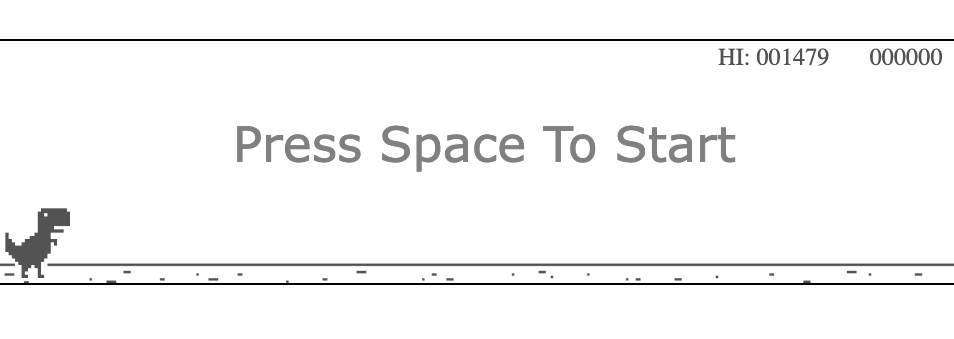
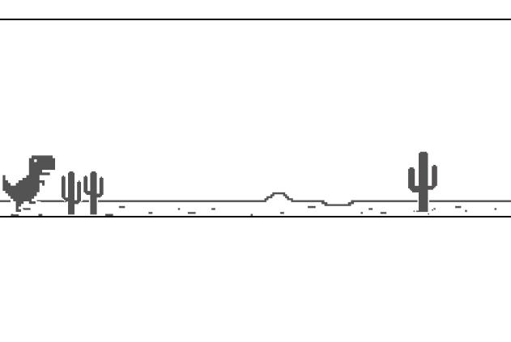

# Welcome to the Dino Game!

Hello all! I'm excited to share my take on the classic dino game you can play when your internet is out. I wanted to learn more about how javascript interacts with the user and wanted to feed my passion for games by creating a fun game to play. I explored the use of HTML element `<canvas>` and its power when combined with JavaScript.

## Screenshots

Tutorial Followed: https://www.youtube.com/watch?v=ooru4pyEv1I

Contact Info:

